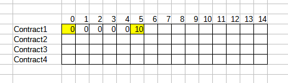
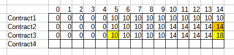
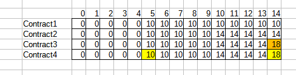

# Introduction
This is a FastAPI application. There are several endpoints which run different algorithms to give a solution to the Spaceship Rental Problem.

# Installation and Running
## Installing on your local machine
It is recommended to create a virtual environment to isolate the dependencies for this application and avoid conflicts with other projects in your machine

### Windows
```
python -m virtualenv venv
venv/Scripts/activate
```

### Linux
```
python3 -m virtualenv venv
venv/bin/activate
```

### Windows/Linux
`pip install -r requirements.txt`

### Run
``` 
python run.py -h 0.0.0.0 -p 8080
python3 run.py -h 0.0.0.0 -p 8080 
```

FastAPI provides a swagger UI for ease of testing. It will be available at `https://localhost:8080/docs`

## Docker
A dockerfile is also available should you want to run this application in a container.
```
docker build -t spaceship-rental .
docker run -p 8080:8080 spaceship-rental -H 0.0.0.0 -p 8080
```

After building the image, you can share it with others so they won't have to re-build it to run the application.

# Project Structure
The entry point (run.py) to the application is at the top level of this repository.

Source code resides within the app folder, which has the following structure
```
app
|--api
   |--endpoints
   |--mappers
   |--schemas
|--services
|--utils
main.py
tests
|--services

```

### **main.py**
Here endpoints are registered to the application, configure CORS and add custom exception handlers

### **api**
- The endpoints folder contains the different endpoints
- The mappers folder contains mappers to translate the arguments and outputs between api and services
- The schemas folder contains the models for the requests and response models of the endpoints. Each model can be validated by its own set of rules in this folder.

### **services**
- This folder contains the different algorithms that will calculate solutions to the Spaceship Rental problem.
- The spaceship-utils.py file contains functions that can be reused in the different algorithms
  - I'd especially like to hightlight the `early_termination` decorator, which terminates the algorithm early if 1 or 0 contracts are provided in the payload, which makes the problem trivial.

### **utils**
- This folder is meant for functions that can be used anywhere in the application. In this application,custom exceptions are defined in here

# Assumptions
- Contract names are unique
- Duration must be greater than 0
- The given list of contracts is not sorted in any way
- The order of the contracts in the solution does not matter
- If two contracts are exactly the same, it does not matter which is chosen
- The earliest possible start time is 0


# Dynamic Programming Solution
The Dynamic Programming (DP) will be the solution I am presenting for this test. This solution guarantees a valid set of contracts that optimizes for profit, at the cost of some memory.

</img>

When a contract is completed, we compare whether it is more profitable to include the contract by summing its value and the value at the the start of the contract. In this case 10+0=10. The rest of the row is filled with 10 before moving onto the next contract.

</img>

Up to the end of the second contract (hour 10), we simply copy the above row. At hour 10, we compare the profit that could be made by accepting the contract with the previous row. Since 0+14 > 10, we accept the contract and whatever contract was already accepted at the start of this contract (in this case it's nothing). The rest of the row is filled with 14.

</img>

At hour 14, we compare the possible profit to the previous row. Since 8+10>14, we accept Contract1 and Contract3.

</img>

At hour 14, we compare the possible profit to the previous row. Since 7+10<18, we reject Contract4 and keep Contract1 and Contract3.

### Runtime and Space Analysis

The running time of this solution is *O(mn + n log n)*, where *n* is the number of contracts, and *m* is the latest time a contract will end.The set of contracts is sorted at the start of the algorithm, running at *O(n log n)* time The comparisons and calculation done in each iteration are simple and will run in constant time. 

Two 2D arrays are maintained in this solution, both of size *m* by *n*.
The first array is an array of profits, while the other is the set of corresponding set of contracts. As such, the space complexity of this solution is also *O(mn)*

The DP solution is mapped to the /optimize endpoint.

# Other Solutions
Besides the DP solution, there are endpoints that correspond to other approaches to the problem. These algorithms will generate a valid set of contracts (no overlaps), but they may not be optimal. Nevertheless, these algorithms may reflect actual processes in the real world.
### **Brute Force**
All possible combinations of contracts are generated. We then look at each combination to see if there are overlapping contracts. If so, they are removed. We then pick the most profitable set of contracts.

This solution is guaranteed to provide the optimal answer as we look at all possible combinations. However, the number of combinations will grow exponentially with the number of contracts, thus making this solution unsuitable for cases where there are a large number of contracts.

## **First Come First Served**
In this solution, we first sort the contracts by start time. The first contract is accepted. The following contracts are accepted only if the current contract has ended. If a valuable contract may be easily missed if there is an earlier contract that shares an overlap.

## **Greedy**
Here we take the unique approach of sorting the contracts by value, and accepting the highest value contract first, and discarding any following contracts that overlaps with it. This approach fails when there may be multiple contracts that add up to a profit that is greater than the first contract.

## **Random Selection**
A combination of contracts is randomly selected and presented. If the combination is invalid, we throw an error. This is obviously a bad approach as it does not even guarantee a valid combination.


# Bug Report
The ManyFlights.json was a test case that failed. Upon debugging, I found the following, where a contract was selected despite having a lower profit. We can see in the image above, that the 2nd to last contract was ignored over the last one.

</img>

I determined that the below piece of code was responsible. It was originally intended to slightly speed up the algorithm by skipping any comparisons after a contract is completed, but I had failed to account for the situation where a contract may start later than a previous be end before it.

</img>

I have replaced it with the following, ensuring to compare contracts at every hour, but still avoiding repeated calculation of profit (which admittedly is trivial).

</img>